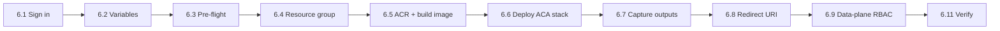

# Transition Agent — Azure Deployment Plan

**Status:** In progress — App Service blocked by quota, retargeted to Container Apps
**Target:** **Azure Container Apps** (consumption) for the Flask/Waitress web app
**Fallback target:** Azure App Service (Linux container) — template retained, needs VM quota
**IaC:** Bicep · **Deploy shape:** container via ACR (`az acr build`)
**Date:** 2026-07-14 · **Retargeted:** 2026-08-10

---

## 1. Workspace analysis (mode: MODIFY / add deployment)

- **App type:** Python web app — Flask (`app.py`) served in production by Waitress (`serve.py`).
- **Container:** `Dockerfile` (python:3.12-slim, non-root, healthcheck on `/healthz`). Fixed to install the full dependency set (Azure SDKs) via `requirements.txt`.
- **Config:** fully env-driven via `config.py` / `.env` (see `.env.example`), including the per-section item caps (`MAX_*`).

## 2. Decisions (confirmed)

| Decision | Choice |
|---|---|
| IaC format | **Bicep** |
| Compute host | **Azure Container Apps** (consumption). App Service rejected at deploy time: subscription has `Total VMs` quota 0, so no dedicated plan can be created |
| Deploy shape | **Container** (existing Dockerfile, built in ACR) |
| Image build | `az acr build` (server-side; no local Docker — WSL2 backend unavailable locally) |
| App identity | **User-assigned managed identity** (ACA requires the pull identity to hold `AcrPull` before the app exists; the same identity serves Cosmos/Storage). Created per deployment by default, or pass `existingIdentityResourceId` to reuse a long-lived one so the data-plane grants survive redeploys |
| Replicas | **Autoscales 1–10** on HTTP concurrency. In-process mode uses ingress **sticky sessions** (per-user token cache + refresh state in memory); optional **Redis** mode (`redisHost`) makes the web tier stateless and adds an autoscaling `<appName>-worker` |
| Secrets | Container App secrets (Key Vault noted as hardening) |
| Region | `eastus2` (co-located with Cosmos `caigcosmoscj1-eastus2`) |
| Subscription | `103e8828-c726-4179-8c6a-d4950310ab64` (ME-MngEnvMCAP150950), tenant `7ec2f66d` |

## 3. Components → Azure services

| Component | Azure service | Provisioning |
|---|---|---|
| Web app | **Container Apps** environment + app (consumption, 0.5 vCPU / 1Gi) | NEW (Bicep) |
| Logs | **Log Analytics** workspace (ACA environment logs) | NEW (Bicep) |
| App identity | **User-assigned managed identity** | NEW (Bicep) |
| Image registry | **Azure Container Registry** (Basic) `acrlzhjdznprmqhi` | EXISTS (created by the App Service attempt; reused) |
| Handover store | **Cosmos DB** `caigcosmoscj1` (`transition-agent`/`handovers`, `/id`) | REUSE — verified present |
| File backup | **Storage** `transitionagentstorecj1` (`handover-backups`) | REUSE — verified present, same tenant |
| Sign-in | **Entra app** `00815db6…` | REUSE (add redirect URI) |

## 4. Identity & RBAC

- Container App **user-assigned MI** → `AcrPull` on the ACR (in Bicep, created before the app).
- Post-deploy grants: `Storage Blob Data Contributor` on `transitionagentstorecj1` + Cosmos `Built-in Data Contributor` on `caigcosmoscj1` (resource group `cosmosaigraph-rg`).
- The app reaches both stores through that identity via `COSMOS_MANAGED_IDENTITY_CLIENT_ID` and `AZURE_STORAGE_MANAGED_IDENTITY_CLIENT_ID`.
- Cosmos/Storage confirmed in the **same tenant** as the workload, so key-based access is not needed.

## 5. Artifacts generated

- `infra/aca.bicep` — ACR, Log Analytics, user-assigned identity, AcrPull, Container Apps environment + app. **Compiles clean.**
- `infra/aca.parameters.json` — non-secret parameter values (incl. `sectionLimits`, `workiqEnabled=false`).
- `infra/main.bicep` / `infra/main.parameters.json` — App Service variant, retained for subscriptions that have VM quota.
- `DEPLOYMENT.md` — both paths end to end (Path A Container Apps, Path B App Service).
- `Dockerfile` — dependency install fixed (full `requirements.txt`, Linux-safe `msal`).

## 6. Deployment runbook (end-to-end)

Pipeline position: `azure-prepare` (this plan + infra) → **azure-validate** → **azure-deploy**.

All commands are **PowerShell**, run from the repository root. Steps 6.1–6.9 are the first
deployment; steps 6.10+ are day-2 operations.



> **Order matters.** On Container Apps the image must exist **before** the app is created,
> so the registry and `az acr build` come first (6.5). Sign-in fails until step 6.8, and
> Cosmos/Storage reads fail until step 6.9 propagates.

### 6.0 Prerequisites

| Requirement | Check |
|---|---|
| Azure CLI ≥ 2.60 with Bicep | `az version` |
| Rights to create resources **and assign roles** (Owner or Contributor + User Access Administrator) on the subscription | `az role assignment list --assignee <you> -o table` |
| Entra app `00815db6-c56b-4e2e-a023-9ae44dd7f08b` with a valid client secret | Azure portal → App registrations |
| Admin consent granted for the delegated Graph scopes (`User.Read.All`, `People.Read`, `Calendars.Read`, `Mail.Read`, `Tasks.Read`, `Files.Read.All`, `Sites.Read.All`, `Team.ReadBasic.All`, `GroupMember.Read.All`, `InformationProtectionPolicy.Read`) and `WorkIQAgent.Ask` where Work IQ is provisioned | App registration → API permissions |
| Existing Cosmos account `caigcosmoscj1` and Storage account `transitionagentstorecj1` | `az cosmosdb show`, `az storage account show` |

### 6.1 Sign in and select the subscription

```powershell
az login --tenant 7ec2f66d-b467-4c02-a8c6-4c20748961c5
az account set --subscription 103e8828-c726-4179-8c6a-d4950310ab64
az account show --query "{sub:name, tenant:tenantId}" -o table
```

### 6.2 Set variables

```powershell
$RG       = "rg-transition-agent"
$LOCATION = "eastus2"          # co-located with Cosmos (caigcosmoscj1-eastus2)
$APPNAME  = "transitionagent"
$ACR      = "acrlzhjdznprmqhi"   # existing registry; a new one must be globally unique
$COSMOS   = "caigcosmoscj1"
$COSMOSRG = "cosmosaigraph-rg"
$STORAGE  = "transitionagentstorecj1"
```

### 6.3 Pre-flight checks

**Cosmos database + container must already exist.** `storage.py` calls
`create_database_if_not_exists` / `create_container_if_not_exists`, but in managed-identity
mode the app holds only *data-plane* rights — creating a database or container is a
control-plane operation and will fail. Create them once (partition key `/id`):

```powershell
az cosmosdb sql database create -a $COSMOS -g $COSMOSRG -n transition-agent
az cosmosdb sql container create -a $COSMOS -g $COSMOSRG -d transition-agent -n handovers --partition-key-path "/id"
```

The blob container is created by the app on first backup, so it needs no pre-provisioning.

> Verified on 2026-08-10: database `transition-agent` and container `handovers` (`/id`)
> already exist, and both data stores sit in `cosmosaigraph-rg` in the **same tenant** as
> the workload — so managed identity works and key-based access is unnecessary.

Register the Container Apps providers (once per subscription) and validate the template:

```powershell
az provider register -n Microsoft.App --wait
az provider register -n Microsoft.OperationalInsights --wait

az bicep build --file infra/aca.bicep --stdout | Out-Null   # syntax
```

### 6.4 Create the resource group

```powershell
az group create --name $RG --location $LOCATION
```

### 6.5 Create the registry and build the image

The Container App references the image at creation time, so the registry and image come
first. Skip `az acr create` if the registry already exists.

```powershell
az acr create -n $ACR -g $RG --sku Basic          # only if it does not exist yet
chcp 65001 > $null                               # az acr build's log streamer dies on cp1252
az acr build --registry $ACR --image transition-agent:latest .
az acr repository show-tags -n $ACR --repository transition-agent -o tsv
```

> A `UnicodeEncodeError: 'charmap' codec can't encode…` from `az acr build` is a
> **client-side log-rendering bug**, not a build failure. Confirm the real state with
> `az acr task list-runs -r $ACR --top 1 -o table` and wait for `Succeeded`.

### 6.6 Deploy the Container Apps stack (Bicep)

Generate a **stable** `SECRET_KEY` (a new value on every deploy invalidates live sessions)
and read the client secret without echoing it:

```powershell
# 256-bit key. Do NOT use `Get-Random -Count 64` over a 16-char alphabet: it draws
# DISTINCT items, so it silently caps at 16 chars (~44 bits) instead of 64.
$bytes = New-Object byte[] 32
[System.Security.Cryptography.RandomNumberGenerator]::Fill($bytes)
$SECRET_KEY = -join ($bytes | ForEach-Object { $_.ToString('x2') })
$CLIENT_SECRET = Read-Host "Entra app client secret" -AsSecureString
$CLIENT_SECRET_PLAIN = [System.Runtime.InteropServices.Marshal]::PtrToStringAuto(
  [System.Runtime.InteropServices.Marshal]::SecureStringToBSTR($CLIENT_SECRET))

az deployment group create `
  --resource-group $RG `
  --name aca `
  --template-file infra/aca.bicep `
  --parameters infra/aca.parameters.json `
  --parameters acrName=$ACR aadClientSecret=$CLIENT_SECRET_PLAIN secretKey=$SECRET_KEY
```

This creates (or reuses) the ACR, plus the Log Analytics workspace, the user-assigned
managed identity, its `AcrPull` assignment, the Container Apps environment, and the app
itself with ingress on port 3000, sticky sessions, and HTTP-concurrency autoscaling
(1–10 replicas). Passing `redisHost` + `redisPassword` also deploys the refresh worker.

**Tenant without Work IQ** — `infra/aca.parameters.json` already sets `workiqEnabled=false`
so refreshes use the Graph collector directly instead of returning empty Work IQ results.

**Per-section caps** — the `sectionLimits` parameter seeds `MAX_CONTACTS`, `MAX_PROJECTS`,
`MAX_IMPORTANT_FILES`, `MAX_RECURRING_PROCESSES`, `MAX_OUTSTANDING_ITEMS`,
`MAX_ACCESS_TRANSFERS`. Edit that file before deploying, or change them later (step 6.10).
Any key you omit falls back to the default in `config.py`.

### 6.7 Capture the outputs

```powershell
$OUT = az deployment group show -g $RG -n aca --query properties.outputs -o json | ConvertFrom-Json
$CAPP      = $OUT.containerAppName.value
$APPURL    = $OUT.appUrl.value
$REDIRECT  = $OUT.redirectUri.value
$PRINCIPAL = $OUT.identityPrincipalId.value    # user-assigned identity
$CLIENTID  = $OUT.identityClientId.value
"APP=$CAPP  URL=$APPURL"
```

### 6.8 Register the redirect URI on the Entra app

```powershell
$APPID = "00815db6-c56b-4e2e-a023-9ae44dd7f08b"
# @(...) forces an array: with a single existing URI, ConvertFrom-Json returns a STRING
# and "+" would concatenate every URI into one malformed entry, dropping the originals.
$existing = @(az ad app show --id $APPID --query "web.redirectUris" -o json | ConvertFrom-Json)
$updated  = @($existing + $REDIRECT + "$APPURL/login") | Select-Object -Unique
az ad app update --id $APPID --web-redirect-uris $updated
az ad app show --id $APPID --query "web.redirectUris" -o json   # verify
```

### 6.9 Grant the managed identity data-plane access

Same-tenant (default MI mode). **Storage — Blob Data Contributor:**

```powershell
$STORAGE_ID = az storage account show -n $STORAGE --query id -o tsv
az role assignment create --assignee-object-id $PRINCIPAL --assignee-principal-type ServicePrincipal `
  --role "Storage Blob Data Contributor" --scope $STORAGE_ID
```

**Cosmos — Built-in Data Contributor** (data-plane SQL role `00000000-0000-0000-0000-000000000002`):

```powershell
$COSMOS_ID = az cosmosdb show -n $COSMOS -g $COSMOSRG --query id -o tsv
az cosmosdb sql role assignment create --account-name $COSMOS -g $COSMOSRG `
  --role-definition-id "00000000-0000-0000-0000-000000000002" `
  --principal-id $PRINCIPAL --scope $COSMOS_ID
```

Grants take a few minutes to propagate; until then the app logs auth errors against
Cosmos/Storage.

> `$PRINCIPAL` is the **user-assigned** identity's principal id. The app authenticates as
> that identity because `COSMOS_MANAGED_IDENTITY_CLIENT_ID` and
> `AZURE_STORAGE_MANAGED_IDENTITY_CLIENT_ID` are set to its client id by the template.

**Cross-tenant alternative.** If Cosmos/Storage ever move to a different tenant, managed
identity cannot reach them and the app must fall back to keys (`COSMOS_KEY`,
`AZURE_STORAGE_CONNECTION_STRING` with `*_USE_MANAGED_IDENTITY=false`). `infra/aca.bicep`
does not model that mode — the App Service template does, via `useKeyBasedDataAccess=true`.

### 6.10 Tune app settings after deployment

Updating environment variables rolls a new revision automatically — no restart needed:

```powershell
az containerapp update -n $CAPP -g $RG --set-env-vars MAX_PROJECTS=20 MAX_IMPORTANT_FILES=20
az containerapp update -n $CAPP -g $RG --set-env-vars WORKIQ_ENABLED=false GRAPH_DETECT_PII=true
```

Every variable and its meaning is in `.env.example`.

### 6.11 Verify

```powershell
Invoke-RestMethod "$APPURL/healthz"                 # status/version/user count
Start-Process $APPURL                               # dashboard → sign in with Entra
az containerapp logs show -n $CAPP -g $RG --follow  # live container logs
```

| Check | Expected |
|---|---|
| `GET /healthz` | `{"status":"ok", "version":"…", "refreshEnabled":true}` |
| `GET /api/me` after sign-in | `authenticated: true`, correct `workiqEnabled` |
| `POST /api/refresh` | `{"ok":true, "mode":"workiq"\|"graph"}` — the mode you expect for this tenant |
| `GET /api/refresh/status` | progresses to `Refresh complete.` with no `ERROR:` lines |
| Dashboard | brief renders; edits survive a subsequent refresh |
| Blob backup | selected files land in `handover-backups/<upn>/<timestamp>/` |

### 6.12 Redeploy, roll back, tear down

```powershell
# new application code -> rebuild the image, then roll a new revision
az acr build --registry $ACR --image transition-agent:latest .
$REV = az containerapp show -n $CAPP -g $RG --query properties.latestRevisionName -o tsv
az containerapp revision restart -n $CAPP -g $RG --revision $REV

# infrastructure/env-var change only -> re-run the Bicep deployment (idempotent)
az deployment group create -g $RG --name aca --template-file infra/aca.bicep `
  --parameters infra/aca.parameters.json `
  --parameters acrName=$ACR aadClientSecret=$CLIENT_SECRET_PLAIN secretKey=$SECRET_KEY

# roll back to a previous image (tag builds to make this possible)
az acr repository show-tags -n $ACR --repository transition-agent -o table
az containerapp update -n $CAPP -g $RG --image "$ACR.azurecr.io/transition-agent:<previous-tag>"

# tear down everything in the resource group (Cosmos/Storage live elsewhere and survive)
az group delete --name $RG --yes --no-wait
```

### 6.13 Troubleshooting

| Symptom | Cause / fix |
|---|---|
| `Unauthorized … Current Limit (Total VMs): 0` on the App Service plan | Subscription has no dedicated App Service quota — deploy `infra/aca.bicep` (Container Apps) instead, or request quota |
| `az acr build` exits with `UnicodeEncodeError: 'charmap'…` | Windows console encoding bug in the CLI log streamer; the build still runs. `chcp 65001` first, and check `az acr task list-runs` |
| Container App stuck provisioning / `ImagePullFailure` | Image tag missing (build in 6.5 first), or the `AcrPull` assignment has not propagated |
| Sign-in loops or `AADSTS50011` | Redirect URI missing on the app registration — run 6.8 |
| `Authorization_RequestDenied` on `/me/manager` | `User.Read.All` not admin-consented |
| Cosmos 403 at startup | RBAC not propagated (6.9), database/container missing (6.3), or the identity client id not wired |
| Refresh returns `mode: workiq` but sections are empty | Tenant not onboarded to Work IQ — set `WORKIQ_ENABLED=false` (6.10) |
| Files carry no PII badge | `InformationProtectionPolicy.Read` not consented, or `GRAPH_DETECT_PII=false` |
| Sessions drop after a revision roll | `SECRET_KEY` changed between deploys — reuse a stable value |
| `/api/refresh/status` returns "not running" mid-refresh | Multiple replicas **without** Redis and with sticky sessions off — either keep sticky sessions on (default) so a user stays on the replica that holds their in-memory state, or enable Redis mode so status is shared across replicas |

## 7. Open risks / follow-ups

- **SECRET EXPOSURE (action required).** `.dockerignore` did not exclude `.env`, and the `Dockerfile` uses `COPY . .`, so image builds `ch1`/`ch2` (tag `latest`) contain the live `AAD_CLIENT_SECRET` and the generated `.secret_key.txt`. Verified by running the image. Remediation: `.dockerignore`/`.gitignore` fixed and clean images rebuilt (`2026-08-10-3` onward, verified free of secret files). **Still outstanding: rotate the Entra client secret, update the Container App secret, and delete the `latest` tag from ACR.**
- **App Service quota (resolved by retargeting):** `Microsoft.Web` reported `Total VMs` limit 0 on this subscription, so no dedicated plan could be created. Workload moved to Container Apps; `infra/main.bicep` stays for subscriptions that do have quota.
- **Tenancy (resolved):** Cosmos `caigcosmoscj1` and Storage `transitionagentstorecj1` are both in `cosmosaigraph-rg` in tenant `7ec2f66d`, the same tenant as the workload — managed identity is viable, no key-based mode needed.
- **Liveness/store coupling (fixed):** `/healthz` used to fail when Cosmos was unreachable, which failed the ACA probe and restarted the container in a loop. It now returns 200 with `store: ok|unavailable`.
- **Horizontal scaling (implemented).** The web tier autoscales on HTTP concurrency. In the
  default **in-process** mode the token cache and refresh state stay in memory, so ingress
  **sticky sessions** keep each user on one replica. For unbounded scale, set the `redisHost`
  / `redisPassword` parameters: the MSAL cache, refresh status, and refresh queue move to
  Redis (`redis_store.py`) and a separate `<appName>-worker` Container App (`worker.py`)
  drains the queue and autoscales on its depth. See DEPLOYMENT.md §A3.1.
- **Entra redirect URI** must be added for the deployed ingress host before sign-in works (step 6.8) — still outstanding.
- **Cosmos role scope:** granted at account scope (*Built-in Data Contributor*). Narrowing to `/dbs/transition-agent/colls/handovers` is a hardening follow-up.
- **Secrets live in Container App secrets**, not Key Vault. Moving to `keyVaultUrl` references is the recommended enterprise hardening (see DEPLOYMENT.md).
- **Local Docker build** not validated (WSL2 has no distro on this machine); image builds server-side in ACR instead.
- `User.Read.All` still needs admin consent on the app registration for manager reads.
- **Cost note:** the Container Apps environment plus a warm `minReplicas` (default 1) bills
  continuously; set `minReplicas: 0` on the web app and/or worker for scale-to-zero at the
  cost of cold-start latency. Redis (when enabled) and Log Analytics ingestion are the other
  recurring costs.
